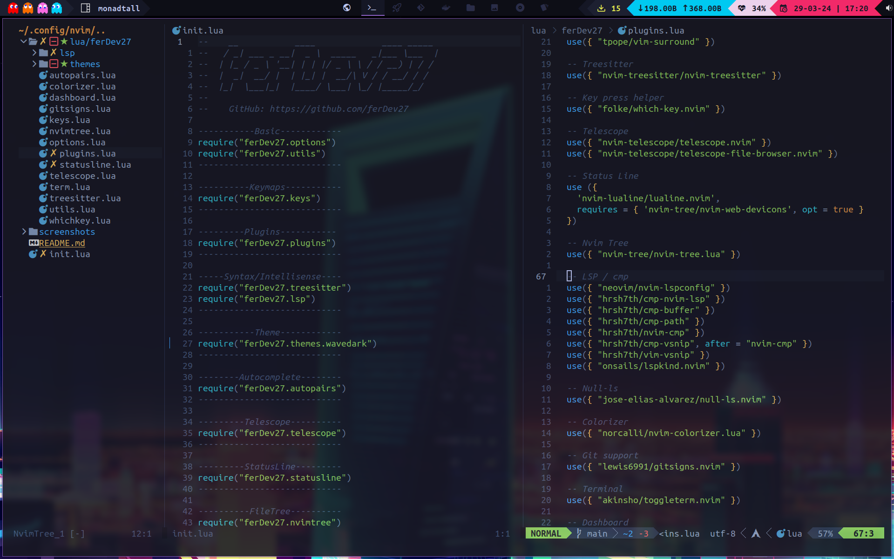
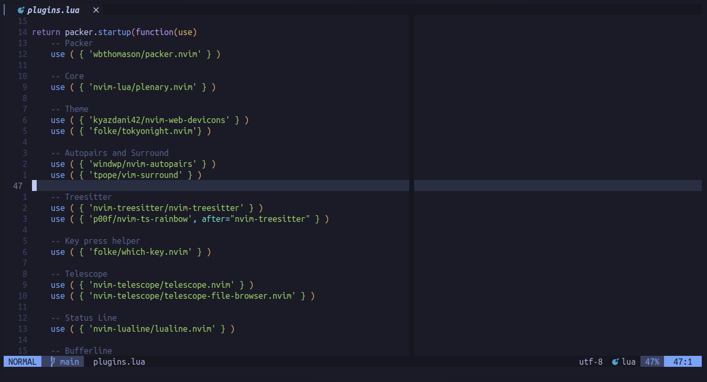

# My Neovim configuration



<h1>Dependencies:</h1>
In order to proceed we will need a few things

<h2>LSP (Language server protocol)</h2>

```bash
npm i -g vscode-langservers-extracted
```

```bash
npm install -g typescript typescript-language-server
```

```bash
npm install -g intelephense
```

```bash
pip install "python-lsp-server[all]"
```

```bash
sudo pacman -S clang
```

<h2>Telescope</h2>

```bash
sudo pacman -S fd ripgrep
```

<h1>Installation</h1>
You need to clone the repo:

```bash
cd ~/.config
git clone https://github.com/ferDev27/nvim.git
```

Open init.lua
```bash
cd ~/.config/nvim
nvim init.lua
```

**Wait for the installation to finish, and you are set**


